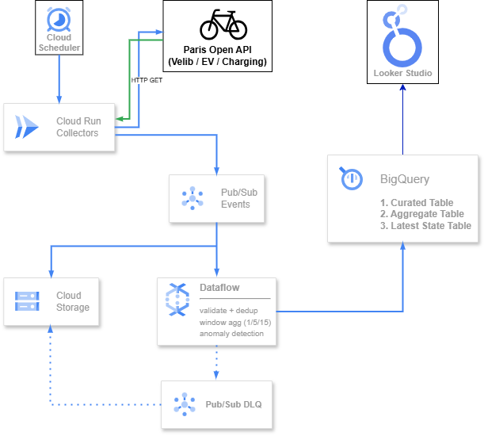

# Paris Mobility Pulse (Streaming Data Engineering on GCP)

Real-time pipeline that ingests Paris mobility signals (starting with Vélib station_status), processes events in near real-time, and stores them in BigQuery for analytics.

## Architecture



## What’s implemented (Step 1–2)
- Cloud Run collector (`pmp-velib-collector`) polls Vélib station_status and publishes JSON events to Pub/Sub (Publish/Subscribe).
- Cloud Run writer (`pmp-bq-writer`) receives Pub/Sub (Publish/Subscribe) push messages and inserts into BigQuery raw table.
- Dataflow (Google Cloud Dataflow) streaming (Apache Beam) reads from `pmp-events-dataflow-sub`, validates + dedups, and writes curated rows to `pmp_curated.velib_station_status`.

## Key GCP resources
- Project: `paris-mobility-pulse`
- Region (Cloud Run): `europe-west9`
- Pub/Sub topic: `pmp-events`
- Push subscription: `pmp-events-to-bq-sub`
- BigQuery dataset: `pmp_raw`
- BigQuery table: `velib_station_status_raw`
- Scheduler job: `velib-poll-every-minute` (location: `europe-west1`)

## Quick validation
Check latest rows:

```sql
SELECT ingest_ts, event_ts, source, event_type, key
FROM `paris-mobility-pulse.pmp_raw.velib_station_status_raw`
ORDER BY ingest_ts DESC
LIMIT 20;
```

## Operations (Demo Mode)

The project includes a control script to safely start/stop the pipeline and manage costs. This is the **most practical way** to run the pipeline for demos.

```bash
./scripts/pmpctl.sh status   # Show current state
./scripts/pmpctl.sh up       # Start ingestion + Dataflow
./scripts/pmpctl.sh collect  # Trigger collectors once
./scripts/pmpctl.sh down     # Stop all cost-generating resources
```
See [07 - Operations: Demo Control](./docs/07-operations-demo-control.md) for details.

## Cost control (Manual)

Pause ingestion when not demoing:

```bash
gcloud scheduler jobs pause velib-poll-every-minute --project=paris-mobility-pulse --location=europe-west1
```

Resume:

```bash
gcloud scheduler jobs resume velib-poll-every-minute --project=paris-mobility-pulse --location=europe-west1
```

## Dataflow: Pub/Sub → Curated BigQuery (Streaming)

Run the Apache Beam pipeline on DataflowRunner to write curated rows to BigQuery.

### Prerequisites

1. **Authenticated Google Cloud SDK**:
   - `gcloud auth login`
   - `gcloud auth application-default login`
   - **Fix**: Run `gcloud auth login --update-adc` if `gsutil` or Dataflow complains about "Anonymous caller".
2. **Environment**:
   - Bucket accessible: `gs://pmp-dataflow-paris-mobility-pulse`
   - APIs enabled: Dataflow, Pub/Sub, BigQuery.
   - Project dependencies: `pip install -r pipelines/dataflow/pmp_streaming/requirements.txt`

### Run the Pipeline

```bash
PROJECT_ID="paris-mobility-pulse"
REGION="europe-west9"
BUCKET="gs://pmp-dataflow-${PROJECT_ID}"
INPUT_SUB="projects/${PROJECT_ID}/subscriptions/pmp-events-dataflow-sub"
OUT_TABLE="${PROJECT_ID}:pmp_curated.velib_station_status"

python3 -m pipelines.dataflow.pmp_streaming.main \
  --runner DataflowRunner \
  --allow_dataflow_runner \
  --project "$PROJECT_ID" \
  --region "$REGION" \
  --temp_location "$BUCKET/temp" \
  --staging_location "$BUCKET/staging" \
  --job_name "pmp-velib-curated-$(date +%Y%m%d-%H%M%S)" \
  --service_account_email "pmp-dataflow-sa@${PROJECT_ID}.iam.gserviceaccount.com" \
  --streaming \
  --input_subscription "$INPUT_SUB" \
  --output_bq_table "$OUT_TABLE" \
  --setup_file ./setup.py \
  --requirements_file pipelines/dataflow/pmp_streaming/requirements.txt \
  --num_workers 1 \
  --max_num_workers 1 \
  --autoscaling_algorithm=NONE \
  --save_main_session
```

### Verification

**1. List Jobs**
```bash
gcloud dataflow jobs list --project="$PROJECT_ID" --region="$REGION"
```

**2. Query BigQuery (Curated)**
Ensure rows are arriving (disable cache if needed):
```sql
SELECT * FROM `paris-mobility-pulse.pmp_curated.velib_station_status`
ORDER BY ingest_ts DESC
LIMIT 20
```

**3. Test Publish (Optional)**
Publish a single station message to `pmp-events`:
```bash
gcloud pubsub topics publish pmp-events --project="$PROJECT_ID" --message='{"ingest_ts":"2026-01-24T16:00:00Z","event_ts":"2026-01-24T16:00:00Z","source":"velib","event_type":"station_status_snapshot","key":"test:one_station","payload":{"data":{"stations":[{"station_id":123,"stationCode":"X1","is_installed":1,"is_renting":1,"is_returning":1,"last_reported":1768918344,"num_bikes_available":5,"num_docks_available":10,"num_bikes_available_types":[{"mechanical":3},{"ebike":2}]}]}}}'
```

### Stop the Job

The pipeline runs until cancelled.

**CLI:**
```bash
gcloud dataflow jobs cancel JOB_ID --project="$PROJECT_ID" --region="$REGION"
```
*(Replace `JOB_ID` with the ID from the list command)*

**Console:**
Dataflow → Jobs → Select job → **Stop / Cancel**.

## Documentation

Detailed guides for each component:
- [00 - Bootstrap](docs/00-bootstrap.md) - Initial project setup
- [01 - MVP Pipeline](docs/01-mvp-pipeline.md) - Cloud Run ingestion setup
- [02 - Ops & Troubleshooting](docs/02-ops-troubleshooting.md) - Operational procedures
- [03 - Terraform IAC](docs/03-terraform-iac.md) - Infrastructure as Code setup
- [04 - Dataflow Curation](docs/04-dataflow-curation.md) - Streaming processing pipeline
- [05 - BigQuery Marts](docs/05-bigquery-marts-latest-state.md) - Analytics layer and latest state views
- [06 - Vélib Station Information Pipeline](docs/06-velib-station-information-pipeline.md) - Static station metadata collection
- [07 - Operations: Demo Control](docs/07-operations-demo-control.md) - Automated demo lifecycle management

## Next milestone

- Add Dataflow for validation/dedup/windowed aggregates + DLQ.
- Create curated tables (latest state + aggregates) for Looker Studio.
