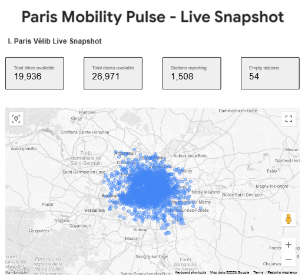
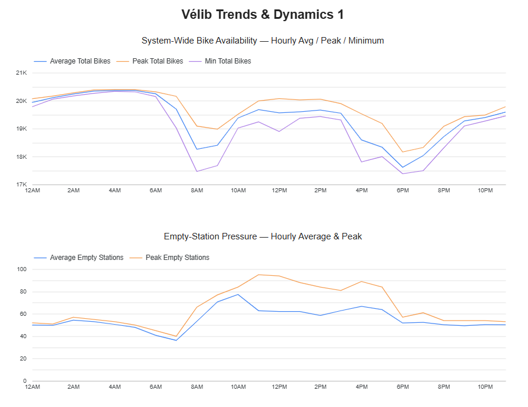
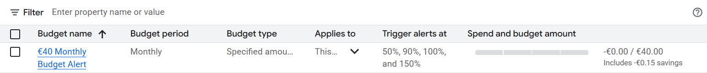

# Paris Mobility Pulse (Streaming Data Engineering on GCP)

[](https://github.com/Selim-Abouleila/Paris-Mobility-Pulse/actions/workflows/ci.yml)


Real-time pipeline that ingests Paris mobility signals (starting with Vélib station_status), processes events in near real-time, and stores them in BigQuery for analytics.

## Quickstart (The Golden Path)

Deploy this entire project to your own Google Cloud project in < 10 minutes.

### 1. Configure
Set up your environment variables (see [00-bootstrap.md](docs/00-bootstrap.md) for details):

```bash
cp .env.example .env
# Edit .env and set YOUR_OWN_PROJECT_ID
```

> [!IMPORTANT]
> **Use your own Project ID.** Do not use `paris-mobility-pulse`.

### 2. Bootstrap & Deploy
```bash
make bootstrap   # Enables APIs, Inits Terraform
make deploy      # Builds Containers, Deploys Infrastructure
```

### 3. Run Demo
```bash
make demo-up     # Starts pipelines & simulated traffic
make demo-down   # Stops all cost-generating resources
```

## Architecture


## What’s implemented
- **Cloud Run collector** (`pmp-velib-collector`) polls Vélib station_status and publishes JSON events to Pub/Sub.
- **Cloud Run writer** (`pmp-bq-writer`) receives Pub/Sub push messages and inserts into BigQuery raw table.
- **Dataflow Streaming** (`pmp-velib-curated`) reads from Pub/Sub, validates formats, and writes curated rows to `pmp_curated.velib_station_status`.
- **Reliability (DLQ)**: Robust Dead Letter Queue (DLQ) implementations for both Metadata (Pub/Sub Push) and Status (Dataflow) paths.
- **DLQ Replay Worker** (`pmp-station-info-dlq-replayer`) is a Cloud Run Job that safely republishes failed metadata events from the hold subscription back to the original topic.
- **BigQuery Marts** layer (`pmp_marts`) provides dashboard-ready views (e.g., `velib_latest_state`).
- **Looker Studio Dashboard** for real-time visualization and trends.
- **Analytics Engineering (dbt)**: Marts layer managed by dbt with `ref()`/`source()` lineage, dynamic BigQuery location detection, and 8 schema tests (`unique`, `not_null`) enforced on every `make deploy`.
- **Reproducible Deployment**: Complete golden path with `make bootstrap`, `make adopt-prod` (adopts existing resources into Terraform state), `make deploy` for zero-trust project-portable infrastructure, and `make clean-cloud` for emergency cleanup of "Already Exists" conflicts.


## Key GCP resources
- **BigQuery**:
    - **Raw Layer** (`pmp_raw`): Landing zone for JSON payloads.
    - **Curated Layer** (`pmp_curated`):
        - `velib_station_status`: History of station updates.
        - `velib_station_information`: Static metadata (names, capacity).
    - **Marts Layer** (`pmp_marts`):
        - `velib_latest_state`: Real-time snapshot (View).
        - `velib_latest_state_enriched`: Latest state + metadata (View).
    - **Ops Layer** (`pmp_ops`):
        - `velib_station_info_push_dlq`: Pub/Sub Push delivery failures (Metadata).
        - `velib_station_status_curated_dlq`: Dataflow transformation/validation failures (Status).
    - **Analytics Layer** (`pmp_dbt_dev_pmp_marts`):
        - **Managed by dbt**: Contains all hourly business logic and aggregations.
        - `velib_totals_hourly_aggregate`: Hourly station snapshots.
        - `velib_totals_hourly`: Clean dashboard view.
        - `velib_totals_hourly_paris`: Filtered view for high-coverage stations.
- **Pub/Sub**:
    - **Topics**: `pmp-events` (Real-time status), `pmp-velib-station-info` (Daily metadata), `pmp-velib-station-info-push-dlq` (Dead Letter Queue).
    - **Subscriptions**:
        - `pmp-events-dataflow-sub`: Streaming pull for Dataflow.
        - `pmp-events-sub`: Debugging/Audit.
        - `pmp-events-to-bq-sub`: Push subscription for MVP (Cloud Run).
        - `pmp-velib-station-info-to-bq-sub`: Push subscription for Station Info (Cloud Run).
        - `pmp-velib-station-info-push-dlq-hold-sub`: 7-day retention for replay.
        - `pmp-velib-station-info-push-dlq-to-bq-sub`: Export to BigQuery (`pmp_ops`).
- **Dataflow**: `pmp-velib-curated` (Streaming ETL).
- **Cloud Run**:
    - `pmp-velib-collector`: Polls real-time station status.
    - `pmp-bq-writer`: Ingests JSON events into BigQuery.
    - `pmp-velib-station-info-collector`: Polls static station metadata (Daily).
    - `pmp-velib-station-info-writer`: Ingests metadata into BigQuery.
    - `pmp-station-info-dlq-replayer`: Cloud Run Job to replay failed metadata events.
- **Cloud Scheduler**:
    - `velib-poll-every-minute` (Every minute): Triggers status collection.
    - `pmp-velib-station-info-daily` (Daily at 03:10): Triggers daily metadata refresh.

## Dashboards

**Vélib Dashboard v1** visualizes real-time station status and hourly availability trends using Looker Studio.

[**View Dashboard**](https://lookerstudio.google.com/reporting/40ae9759-385b-4b7f-9248-325390e3c5df)

<p align="center">
  
  <br>
  
</p>

See [08 - Vélib Dashboard](./docs/08-velib-dashboard.md) for details on data sources and metrics.

## Operations (Demo Mode)

The project includes a control script to safely start/stop the pipeline and manage costs. This is the **most practical way** to run the pipeline for demos.

```bash
./scripts/pmpctl.sh status   # Show current state
./scripts/pmpctl.sh up       # Start ingestion + Dataflow
./scripts/pmpctl.sh collect  # Trigger collectors once
./scripts/pmpctl.sh down     # Stop all cost-generating resources
```
See [07 - Operations: Demo Control](./docs/07-operations-demo-control.md) for details.

## Budget Alert (Cost Guardrail)

A monthly budget alert is configured at **$40/month** to provide a safety guardrail for demo activities and prevent accidental spend. This budget alert complements the project's operational stop controls; see [07 - Operations: Demo Control](./docs/07-operations-demo-control.md) for instructions on pausing or stopping cost-generating resources.



## Dataflow: Pub/Sub → Curated BigQuery (Streaming)

The Dataflow streaming pipeline reads validated events from Pub/Sub, flattens nested station snapshots into one row per station, and writes curated rows to `pmp_curated.velib_station_status`. Errors are captured at three stages (parse, transform, BigQuery insert) and routed to a dedicated DLQ table.

> [!NOTE]
> **Why Dataflow?** This curated table could have been produced with a Cloud Run writer or BigQuery SQL views. Dataflow was chosen to demonstrate **Professional Data Engineer streaming patterns** (side outputs, DLQ, metrics) and to set up safeguards for future complexity (dedup, windowing, replay). Streaming jobs have ongoing cost, so future pipelines may use simpler approaches unless Dataflow's capabilities are needed.

The pipeline is launched via `pmpctl.sh up` (or `make demo-up`) and cancelled via `pmpctl.sh down` (or `make demo-down`). See [04 - Dataflow Curation](docs/04-dataflow-curation.md) for the full Dataflow job launch command, verification queries, and DLQ architecture.

## Analytics Engineering: dbt (Data Modeling)

We have migrated the "Marts" layer logic from brittle Terraform strings to **dbt (data build tool)**, achieving a production-grade Analytics Engineering workflow.

- **Dynamic Location Handling**: The project uses a custom `Makefile` hook to auto-detect the BigQuery dataset location (`EU` vs `europe-west9`) and inject it into dbt at runtime, ensuring portability across regions.
- **Separation of Concerns**: Terraform manages infrastructure (datasets, IAM); dbt manages business logic (SQL, tests).
- **Data Quality**: 8 schema tests (`unique`, `not_null`) are enforced on every deployment via `dbt test`, catching duplicate hours, NULL metrics, and grain violations before they reach the dashboard.

See [docs/11-dbt-analytics-engineering.md](docs/11-dbt-analytics-engineering.md) for the full architecture and migration details.

## Reliability & Error Handling

To ensure production-grade stability, the pipeline implements multi-layered Dead Letter Queue (DLQ) patterns to capture, audit, and replay failures:

### 1. Dataflow Streaming DLQ (Internal)
Captures failures inside the `pmp-velib-curated` pipeline using side-outputs. Errors are branched out at three critical stages:
- **Parse**: Detects JSON malformations or missing required envelope fields.
- **Mapping**: Catches business logic violations (e.g., when the `stations` payload is not a list).
- **BigQuery Insert**: Handles schema drift or transient data type mismatches on write.
- **Destination Table**: `pmp_ops.velib_station_status_curated_dlq`
- **Reference**: [04 - Dataflow Curation](docs/04-dataflow-curation.md)

### 2. Pub/Sub Push DLQ (Infrastructure)
Captures delivery failures for the `station-info` metadata path. If the Cloud Run writer returns a 5xx error or times out, Pub/Sub forwards the message to a dedicated DLQ topic after 5 attempts.
- **Persistence**: Messages are stored in both a **7-day Hold Subscription** (for easy local replay) and a **BigQuery Audit table**.
- **Destination Table**: `pmp_ops.velib_station_info_push_dlq`
- **Reference**: [09 - Reliability: DLQ + Replay](docs/09-reliability-dlq-replay.md)

> [!TIP]
> Use the `scripts/test_dlq.py` utility to end-to-end verify these error paths by injecting deliberate failures into the pipeline.

## CI / Quality Gates

The project enforces strict quality gates on every Pull Request and push to `main`:

- **Linting**: Rules enforced by `ruff`.
- **Formatting**: Unified style via `ruff format` (PEP 8 compliant).
- **Type Checking**: Static analysis via `mypy`.
- **Testing**: Automated smoke tests using `pytest`.
- **Infrastructure**: Terraform `fmt`, `validate`, and `init` checks.

### Run locally
```bash
make install  # Setup dev tools
make check    # Run all quality gates locally
make fmt      # Auto-format code
```
## Development

To maintain code quality, please run the quality gates before pushing:

```bash
make install  # Setup dev tools
make fmt      # Format code (ruff + terraform)
make check    # Check formatting, types, and tests
```
## Security Posture

Designed with a **Zero Trust** and **Least Privilege** mindset for production readiness:

- **Identity**: Dedicated Service Accounts for every component (Collector, Writer, Dataflow, Scheduler) with granular IAM roles.
- **Network**: All Cloud Run services are **Private (No Allow Unauthenticated)** by default. Invocations are authenticated via OIDC tokens from specific authorized SAs.
- **Data Boundaries**: BigQuery datasets (`pmp_raw`, `pmp_curated`, `pmp_marts`) have distinct access controls to enforce separation of concerns.
- **Secrets**: Prepared for Google Secret Manager integration; no secrets stored in code or Terraform state.

See [docs/10-security-posture.md](docs/10-security-posture.md) for the full security architecture and [docs/10x-security-implementation-plan.md](docs/10x-security-implementation-plan.md) for the hardening roadmap.

## Documentation

Detailed guides for each component:
- [00 - Bootstrap](docs/00-bootstrap.md) - Initial project setup
- [01 - MVP Pipeline](docs/01-mvp-pipeline.md) - Cloud Run ingestion setup
- [02 - Ops & Troubleshooting](docs/02-ops-troubleshooting.md) - Operational procedures
- [03 - Terraform IAC](docs/03-terraform-iac.md) - Infrastructure as Code setup
  - [Terraform Resource Reference](infra/terraform/README.md) - Complete managed resource inventory
- [04 - Dataflow Curation](docs/04-dataflow-curation.md) - Streaming processing pipeline
- [05 - BigQuery Marts](docs/05-bigquery-marts-latest-state.md) - Analytics layer and latest state views
- [06 - Vélib Station Information Pipeline](docs/06-velib-station-information-pipeline.md) - Static station metadata collection
- [07 - Operations: Demo Control](docs/07-operations-demo-control.md) - Automated demo lifecycle management
- [08 - Vélib Dashboard](docs/08-velib-dashboard.md) - Looker Studio report and metrics
- [09 - Reliability: DLQ + Replay](docs/09-reliability-dlq-replay.md) - Dead Letter Queue and Replay strategy
- [10 - Security Posture](docs/10-security-posture.md) - Security architecture and hardening plan
- [10x - Security Implementation Plan](docs/10x-security-implementation-plan.md) - Detailed Terraform refactoring roadmap
- [11 - Analytics Engineering (dbt)](docs/11-dbt-analytics-engineering.md) - Migration to dbt for data modeling and quality tests

## Next milestone
- (Optional) Move windowed aggregations from BigQuery MVs to Dataflow.
