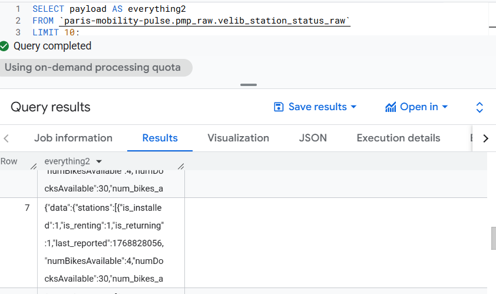

# File: docs/01-mvp-pipeline.md

# MVP Pipeline Deployment

> [!NOTE]
> **This document describes the initial bootstrap phase of the project** — the first pipeline we built to prove the end-to-end flow works, covering only the **Vélib station status** data source. Since then, the platform has grown significantly with:
> - [Dataflow streaming curation + DLQ](04-dataflow-curation.md) (curated layer)
> - [Station information pipeline](06-velib-station-information-pipeline.md) (metadata collection)
> - [dbt analytics engineering](11-dbt-analytics-engineering.md) (marts layer)
> - [Terraform IaC](03-terraform-iac.md) (reproducible infrastructure)
> - [Reliability & replay](09-reliability-dlq-replay.md) (DLQ + replay strategy)
>
> The steps below remain accurate for understanding the foundational architecture, but day-to-day deployment is now handled by `make deploy` (see [README](../README.md)).

## Architecture Overview
**Flow**: Cloud Scheduler → Cloud Run Collector → Pub/Sub (`pmp-events`) → Cloud Run Writer → BigQuery (`pmp_raw.velib_station_status_raw`)

Expected behavior: Cloud Run instances scale to zero when idle to minimize costs.

## 1. Pub/Sub Setup

### Create Topic
```bash
gcloud pubsub topics create pmp-events
```

### (Optional) Debug Subscription
Create a pull subscription to debug messages manually if needed.
```bash
gcloud pubsub subscriptions create pmp-events-sub --topic=pmp-events
```

## 2. Cloud Run Collector

**Service**: `pmp-velib-collector`  
**Region**: `europe-west9`

### Environment Variables
- `TOPIC_ID`: `pmp-events`
- `FEED_URL`: `https://velib-metropole-opendata.smovengo.cloud/opendata/Velib_Metropole/station_status.json`
- `SOURCE`: `velib`
- `EVENT_TYPE`: `station_status_snapshot`

### Deploy
```bash
gcloud run deploy pmp-velib-collector \
  --source ./collectors/velib \
  --region europe-west9 \
  --service-account pmp-collector-sa@paris-mobility-pulse.iam.gserviceaccount.com \
  --set-env-vars "TOPIC_ID=pmp-events,FEED_URL=https://velib-metropole-opendata.smovengo.cloud/opendata/Velib_Metropole/station_status.json,SOURCE=velib,EVENT_TYPE=station_status_snapshot" \
  --no-allow-unauthenticated
```

## 3. Cloud Run Writer

**Service**: `pmp-bq-writer`  
**Region**: `europe-west9`

### Environment Variables
- `BQ_DATASET`: `pmp_raw`
- `BQ_TABLE`: `velib_station_status_raw`

### Deploy
```bash
gcloud run deploy pmp-bq-writer \
  --source ./services/bq-writer \
  --region europe-west9 \
  --service-account pmp-bq-writer-sa@paris-mobility-pulse.iam.gserviceaccount.com \
  --set-env-vars "BQ_DATASET=pmp_raw,BQ_TABLE=velib_station_status_raw" \
  --no-allow-unauthenticated
```

### Retrieve Writer URL
Store the URL for the next step:
```bash
WRITER_URL=$(gcloud run services describe pmp-bq-writer --region europe-west9 --format='value(status.url)')
echo $WRITER_URL
```

## 4. Pub/Sub Push Subscription

Configure Pub/Sub to push messages to the Writer service.

**Subscription**: `pmp-events-to-bq-sub`  
**Endpoint**: `$WRITER_URL/pubsub`  
**Audience**: `$WRITER_URL`

```bash
gcloud pubsub subscriptions create pmp-events-to-bq-sub \
  --topic=pmp-events \
  --push-endpoint=$WRITER_URL/pubsub \
  --push-auth-service-account=pmp-pubsub-push-sa@paris-mobility-pulse.iam.gserviceaccount.com \
  --push-auth-token-audience=$WRITER_URL
```

## 5. IAM Requirements

Ensure service accounts have the correct permissions:

1.  **Collector SA** (`pmp-collector-sa`) needs `roles/pubsub.publisher` on topic `pmp-events`.
2.  **Writer SA** (`pmp-bq-writer-sa`) needs `roles/bigquery.dataEditor` on dataset `pmp_raw`.
3.  **Scheduler SA** (`pmp-scheduler-sa`) needs `roles/run.invoker` on Collector service.
4.  **Pub/Sub Push SA** (`pmp-pubsub-push-sa`) needs `roles/run.invoker` on Writer service.
5.  **Pub/Sub Service Agent** needs `roles/iam.serviceAccountTokenCreator` on the Push SA.

## 6. Verification

### Manual Trigger
Trigger the collector manually:
```bash
gcloud run services proxy pmp-velib-collector --region europe-west9
# Then curl localhost:8080/collect in another terminal or use the urgency of the moment:
curl -H "Authorization: Bearer $(gcloud auth print-identity-token)" $(gcloud run services describe pmp-velib-collector --region europe-west9 --format='value(status.url)')/collect
```

### Check Logs
Confirm Writer received the request:
```bash
gcloud logging read \
  'resource.type="cloud_run_revision" AND resource.labels.service_name="pmp-bq-writer" AND httpRequest.requestUrl="/pubsub"' \
  --limit=5
```

### Check BigQuery
Wait a few seconds, then query:
```bash
bq query --use_legacy_sql=false --nouse_cache \
  'SELECT COUNT(*) FROM `paris-mobility-pulse.pmp_raw.velib_station_status_raw`'
```


