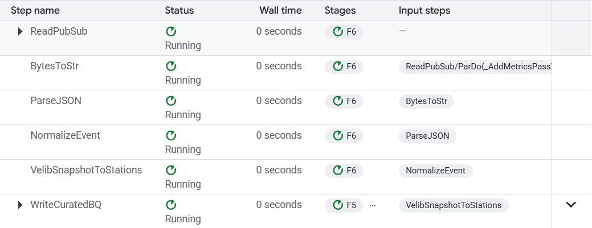

# Dataflow Curation Pipeline

This document details the configuration and execution of the **Dataflow Curation Pipeline** (Streaming) for the Paris Mobility Pulse project.

## 1. Pipeline Overview

The **Phase 1** Dataflow job is a streaming pipeline that performs the following ETL steps:

1.  **Ingest**: Reads JSON events from Pub/Sub subscription `projects/paris-mobility-pulse/subscriptions/pmp-events-dataflow-sub`.
    *   *Source Payload*: Snapshots from APIs (e.g., Vélib `station_status`).
2.  **Normalize**:
    *   Parses the JSON envelope.
    *   Fixes missing or empty `event_ts` by defaulting to `ingest_ts` to ensure valid timestamps for BigQuery.
3.  **Curate & Flatten**:
    *   Explodes the nested `stations` list from the snapshot.
    *   Extracts station-level fields: `station_id`, `num_bikes_available`, `mechanical_available`, `ebike_available`, `is_renting`, `last_reported`.
    *   Produces one flat row per station per snapshot.
4.  **Load**: Writes curated rows to the BigQuery table `paris-mobility-pulse:pmp_curated.velib_station_status`.
    *   *Mode*: Append-only (streaming inserts).
    *   *Partitioning*: By `ingest_ts`.



### Why a Curated Table?

The **curated table** provides a schema-defined, station-grain view, enabling efficient dashboards (Looker Studio), aggregation, and geospatial mapping without complex JSON extraction queries.

---

## 2. Why Dataflow (and when not to use it)

### Why we used Dataflow here
*   **Streaming from Pub/Sub**: Native integration/template for streaming sources.
*   **Curated station-level rows**: Converting nested JSON to flat rows for the dashboard.
*   **Foundation for future**: The pipeline structure allows adding **validation**, **deduplication**, **windowed aggregations**, and **late data handling** later.
*   **"Portfolio / certification alignment"**: Demonstrates standard Google Cloud Data Engineer patterns.

### What simpler alternatives would work
*   **Cloud Run writer**: Could Flatten JSON directly in Python code before inserting to `pmp_curated`.
*   **BigQuery SQL**: Could use SQL Views or Materialized Views over the `pmp_raw` JSON payload.

### Tradeoffs
*   **Dataflow Pros**: Scalability, stateful streaming management, precise event-time windowing, reliability patterns (DLQ).
*   **Dataflow Cons**: Operational overhead and **cost** while running (streaming workers are always on).

### Project direction
Future pipelines may **avoid Dataflow** to reduce cost/complexity, using BigQuery SQL + Cloud Run writers, unless streaming transforms require Dataflow's specific capabilities. This budget discipline is reflected in our operations approach (using `pmpctl.sh` to stop resources) and budget alerts.

---

## 3. Prerequisites

Before running the pipeline, verify your environment:

1.  **Active GCP Project**:
    ```bash
    gcloud config get-value project
    # Should be: paris-mobility-pulse
    ```

2.  **Access to Staging Bucket**:
    ```bash
    gsutil ls -b gs://pmp-dataflow-paris-mobility-pulse
    ```
    *If this fails with "Anonymous caller", run:* `gcloud auth login --update-adc`

3.  **Required APIs Enabled**:
    *   Dataflow API
    *   Pub/Sub API
    *   BigQuery API
    *   Cloud Storage API

4.  **Python Dependencies**:
    Ensure `apache-beam[gcp]` and project requirements are installed:
    ```bash
    pip install -r pipelines/dataflow/pmp_streaming/requirements.txt
    ```

---

## 4. Run the Pipeline

Use the following command to launch the Dataflow job on Google Cloud.

> **Note**: This job configuration uses 1 worker (`--num_workers 1`) and disables autoscaling (`--autoscaling_algorithm=NONE`) to strictly control costs during development.

```bash
PROJECT_ID="paris-mobility-pulse"
REGION="europe-west9"
BUCKET="gs://pmp-dataflow-${PROJECT_ID}"
INPUT_SUB="projects/${PROJECT_ID}/subscriptions/pmp-events-dataflow-sub"
OUT_TABLE="${PROJECT_ID}:pmp_curated.velib_station_status"

python3 -m pipelines.dataflow.pmp_streaming.main \
  --runner DataflowRunner \
  --allow_dataflow_runner \
  --project "$PROJECT_ID" \
  --region "$REGION" \
  --temp_location "$BUCKET/temp" \
  --staging_location "$BUCKET/staging" \
  --job_name "pmp-velib-curated-$(date +%Y%m%d-%H%M%S)" \
  --service_account_email "pmp-dataflow-sa@${PROJECT_ID}.iam.gserviceaccount.com" \
  --streaming \
  --input_subscription "$INPUT_SUB" \
  --output_bq_table "$OUT_TABLE" \
  --setup_file ./setup.py \
  --requirements_file pipelines/dataflow/pmp_streaming/requirements.txt \
  --num_workers 1 \
  --max_num_workers 1 \
  --autoscaling_algorithm=NONE \
  --save_main_session
```

---

## 5. Verification Steps

### 1. List Running Jobs
Verify the job is in `Running` state:
```bash
gcloud dataflow jobs list --project="$PROJECT_ID" --region="$REGION"
```

### 2. Publish Test Message
Send a synthetic message for a single station ("test:one_station") to confirm end-to-end flow:
```bash
gcloud pubsub topics publish pmp-events \
  --project="$PROJECT_ID" \
  --message='{"ingest_ts":"2026-01-24T16:00:00Z","event_ts":"2026-01-24T16:00:00Z","source":"velib","event_type":"station_status_snapshot","key":"test:one_station","payload":{"data":{"stations":[{"station_id":123,"stationCode":"X1","is_installed":1,"is_renting":1,"is_returning":1,"last_reported":1768918344,"num_bikes_available":5,"num_docks_available":10,"num_bikes_available_types":[{"mechanical":3},{"ebike":2}]}]}}}'
```

### 3. Query Curated Table
Check BigQuery for the new row (disable cache to see fresh data):
```bash
bq query --use_legacy_sql=false --nouse_cache \
'SELECT station_id, station_code, num_bikes_available, mechanical_available, ebike_available, ingest_ts
 FROM `paris-mobility-pulse.pmp_curated.velib_station_status`
 ORDER BY ingest_ts DESC
 LIMIT 20'
```

---

## 6. Stop the Pipeline (Cost Control)

This is a **streaming** job. It will run (and incur costs) until manually cancelled.

**Option A: CLI**
1. Find the Job ID:
   ```bash
   gcloud dataflow jobs list --project="$PROJECT_ID" --region="$REGION"
   ```
2. Cancel the job:
   ```bash
   gcloud dataflow jobs cancel JOB_ID --project="$PROJECT_ID" --region="$REGION"
   ```

**Option B: Cloud Console**
1. Navigate to **Dataflow** → **Jobs**.
2. Select the active job.
3. Click **Stop** (Select "Cancel").

---

## 7. Context: Phase 1 & Future Expansion

This pipeline represents **Phase 1** of the Dataflow implementation. We intentionally keep it simple: "Ingest → Normalize/Flatten → Write to BigQuery".

**Future Roadmap**
In later milestones, the Dataflow logic will be expanded to support:
*   **Windowed Aggregations**: Calculating rolling averages or activity metrics over time windows.
*   **Join & Enrichment**: Joining status stream with `station_information` (slowly changing dimension) to add `lat/lon` and names to the stream.
*   **Dead Letter Queues (DLQ)**: Routing malformed messages or schema validation failures to a separate storage bucket/table.
*   **Multiple Outputs**: Using Beam Side Outputs or Tagged Outputs to write to different tables (e.g., Raw, Curated, Aggregated) from a single pass.

Currently, the focus is on establishing a stable streaming writer creating clean, queryable rows.

---

## 8. Troubleshooting

| Issue | Cause | Fix |
| :--- | :--- | :--- |
| **"Anonymous caller does not have storage.buckets.get"** | Your local credentials (ADC) are missing or expired. | Run `gcloud auth login --update-adc`. Then try `gsutil ls -b $BUCKET` to confirm access. |
| **ImportError: No module named pipelines** | Workers cannot find the python modules. | Ensure `setup.py` exists in the repo root and `pipelines/` contains `__init__.py`. Use `--save_main_session` in the specific cases where main session globals are needed. |
| **BigQuery Error: "Invalid timestamp"** | `event_ts` fields might be missing or empty strings. | The pipeline code must normalize `event_ts`. If empty/missing, default to `ingest_ts` before writing to BigQuery. |
