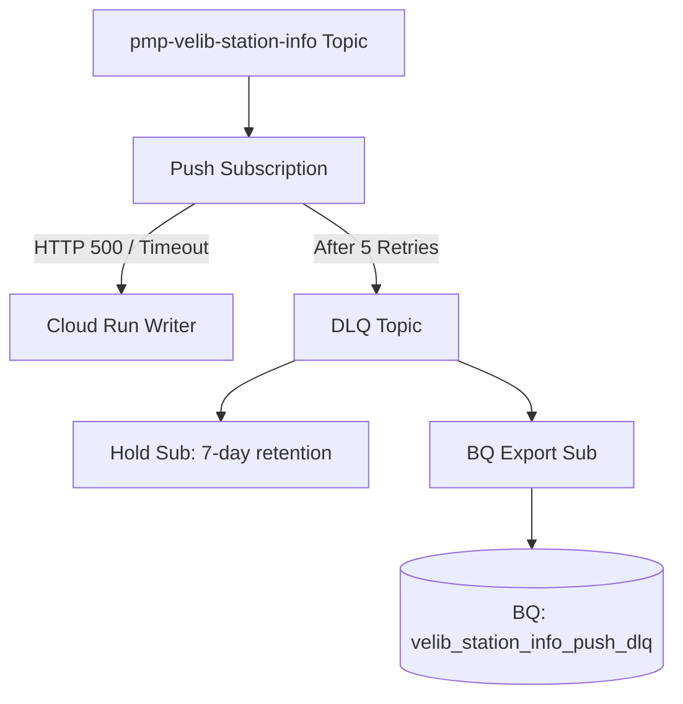
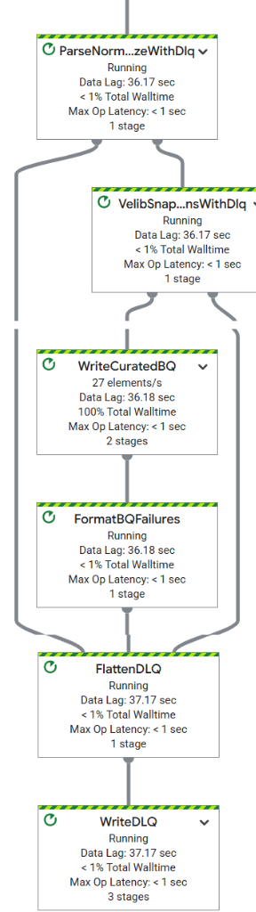

# 09 - Reliability: DLQ + Replay

This document defines the reliability strategy and operational runbook for capturing and replaying failed data in the Paris Mobility Pulse project.

## 1. Goal & Reliability Semantics
The project maintains two distinct reliability paths to handle data processing failures:

1.  **Pub/Sub Push Path (`station-info`)**: Used for low-frequency service-to-service communication.
2.  **Dataflow Streaming Path (`station-status`)**: Used for high-frequency curation pipelines.

> [!IMPORTANT]
> **Station-Info Cadence Reality**
> The `station-info` feed is a daily/low-frequency feed. Under normal conditions, the DLQ should be empty. Any entry in the `velib_station_info_push_dlq` table is a **high-signal event** indicating a writer service failure or a major schema change in the source API.

### How it Works
Failures are captured when:
-   **Pub/Sub Push**: The Cloud Run writer returns a non-2xx status code after 5 retry attempts.
-   **Dataflow**: A parsing error, validation failure, or BigQuery insertion error occurs during streaming.

---

## 2. Architecture
We balance speed (for incident response) and auditability (for long-term analysis) by using dual-path DLQs.

### A. Pub/Sub Push DLQ (Service-to-Service)


### B. Dataflow Curated DLQ (Pipeline-Internal)
Errors are diverted within the Beam graph using Tagged Outputs, ensuring the main pipeline continues processing healthy records.



---

## 3. Data Models

### A. Pub/Sub DLQ Table: `velib_station_info_push_dlq`
Captures raw messages rejected by the Push endpoint.

| Column | Type | Description |
| :--- | :--- | :--- |
| `subscription_name` | STRING | ID of the source subscription that failed. |
| `message_id` | STRING | Unique Pub/Sub message ID. |
| **`publish_time`** | TIMESTAMP | **DLQ Timing**: Reflects the time the message hit the DLQ Topic/Export. |
| `data` | STRING | Raw message payload. |
| `attributes` | STRING | JSON metadata. Includes original source info. |

> [!NOTE]
> **Pub/Sub Timing Semantics**
> To find the **original** publish time from the source topic, query the attributes JSON for `CloudPubSubDeadLetterSourceTopicPublishTime`.

### B. Dataflow DLQ Table: `velib_station_status_curated_dlq`
Captures rich, contextual errors from the streaming pipeline.

| Column | Type | Description |
| :--- | :--- | :--- |
| `dlq_ts` | TIMESTAMP | When the error was captured in the pipeline. |
| `stage` | STRING | Stage: `parse_normalize`, `snapshot_to_station_rows`, `bq_insert_curated`. |
| `error_type` | STRING | Exception category (e.g., `ValueError`, `JSONDecodeError`). |
| `error_message` | STRING | Human-readable description of the failure. |
| `raw` | STRING | Original input attempt (Truncated to 200KB to avoid BQ row limits). |
| `event_meta` | STRING | JSON metadata (source, event_type, ingest_ts). |
| `row_json` | STRING | The record that failed BQ insertion (if applicable). |

---

## 4. Verification (Executable Runbook)

### Test A: Direct DLQ Persistence
Verify that the BQ Export path is healthy.
```bash
gcloud pubsub topics publish pmp-velib-station-info-push-dlq \
  --message='{"test": "direct_publish_check"}'
```
Wait 30s and verify record in `pmp_ops.velib_station_info_push_dlq`.

### Test B: End-to-End Push Forwarding
1.  **Enable Failure Injection**: 
    ```bash
    gcloud run services update station-info-writer --region=europe-west9 \
      --update-env-vars DLQ_TEST_ENABLED=true
    ```
2.  **Publish Drill Message**: 
    ```bash
    gcloud pubsub topics publish pmp-velib-station-info \
      --attribute="dlq_test=true" \
      --message='{"test": "e2e_drill"}'
    ```
3.  **Confirm**: Verify the row in BQ contains attributes starting with `CloudPubSubDeadLetter...`.
4.  **Cleanup**: 
    ```bash
    gcloud run services update station-info-writer --region=europe-west9 \
      --update-env-vars DLQ_TEST_ENABLED=false
    ```

### Test C: Dataflow Pipeline Stage Errors
Verify the internal diversion logic using `scripts/test_dlq.py` (which injects malformed Pub/Sub messages).

1. **Trigger and Check Parse Errors** (Missing envelope):
   ```sql
   SELECT * FROM `pmp_ops.velib_station_status_curated_dlq` 
   WHERE stage = 'parse_normalize' AND error_message LIKE '%Missing source%'
   ```

2. **Trigger and Check Mapping Errors** (`stations` is not a list):
   ```sql
   SELECT * FROM `pmp_ops.velib_station_status_curated_dlq` 
   WHERE stage = 'snapshot_to_station_rows' AND error_message LIKE '%not a list%'
   ```

3. **Check BigQuery Schema Errors** (Type mismatch):
   ```sql
   SELECT * FROM `pmp_ops.velib_station_status_curated_dlq` 
   WHERE stage = 'bq_insert_curated'
   ```

---

## 5. Terraform Infrastructure

Reliability resources are managed in `pubsub.tf` and `bigquery.tf` with underscores (no hyphens).

### Resource Identifiers
- `google_pubsub_topic.station_info_dlq_topic`
- `google_pubsub_subscription.station_info_dlq_sub` (Hold Sub)
- `google_pubsub_subscription.station_info_dlq_bq_sub` (BQ Export Sub, `write_metadata = true`)
- `google_pubsub_subscription.station_info_push_sub` (Source Sub with `dead_letter_policy`)
- `google_bigquery_table.velib_dlq_raw` (Persistent Store)
- `google_bigquery_table.velib_station_status_curated_dlq` (Dataflow DLQ)

### IAM Bindings
- `google_pubsub_topic_iam_member.dlq_publisher_sa`: Pub/Sub Service Agent as Publisher.
- `google_pubsub_subscription_iam_member.source_subscriber_sa`: Pub/Sub Service Agent as Subscriber.
- `google_bigquery_dataset_iam_member.dataflow_sa_pmp_ops_dataeditor`: Dataflow worker write access.

### Import Commands
```bash
# Dataflow DLQ Table
terraform import google_bigquery_table.velib_station_status_curated_dlq \
  projects/paris-mobility-pulse/datasets/pmp_ops/tables/velib_station_status_curated_dlq

# DLQ Topic (Pub/Sub)
terraform import google_pubsub_topic.station_info_dlq_topic \
  projects/paris-mobility-pulse/topics/pmp-velib-station-info-push-dlq
```

---

## 6. Monitoring

### A. Pub/Sub Stack (Official Metrics)
Monitor via Cloud Monitoring:
- `subscription/dead_letter_message_count`: Forwarded to DLQ.
- `subscription/num_undelivered_messages`: Export/Hold backlog.

### B. Dataflow Stack (Beam Counters)
Visible in Dataflow UI Metrics:
- `dlq_parse_normalize_count`: Envelope parsing failures.
- `dlq_snapshot_mapping_count`: Flattening failures.
- **`dlq_bq_insert_count`**: Critical schema drift indicator.

---

## 7. Troubleshooting

- **"DLQ Table is empty but metrics show failures"**: Check `dlq_publisher_sa` permissions. The Service Agent needs `publisher` rights on the DLQ topic.
- **"Duplicates in BigQuery"**: Pub/Sub is at-least-once; use `message_id` to deduplicate.
- **"Payload Truncation"**: The pipeline truncates `raw` fields to 200KB to safely fit BigQuery's row limit.
