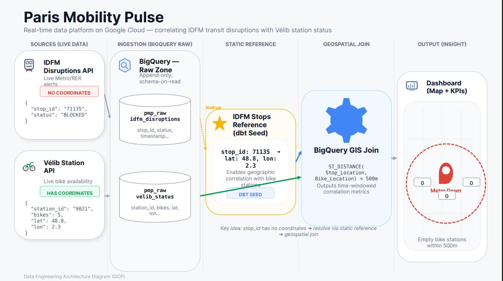

# IDFM Transit Disruptions — Second Data Source

> [!IMPORTANT]
> This document captures the **complete vision** for integrating Île-de-France Mobilités (IDFM) real-time transit disruption data into Paris Mobility Pulse. This is the second data source, transforming the project from a Vélib analytics tool into a **multi-modal Paris mobility intelligence platform**.

## 1. Why This Data Source

### The Strategic Argument

Paris Mobility Pulse currently ingests a single data source (Vélib station status). Adding a second, **fundamentally different** source proves the architecture generalizes and enables cross-source analytics impossible with either source alone.

### The Killer Question

> *"When a metro line is disrupted, do nearby Vélib stations see a spike in bike rentals?"*

This is a genuinely interesting analytics question that demonstrates **platform thinking** — the kind of insight companies like Citymapper and Moovit spend real money trying to surface.

### What It Proves

| Dimension | Vélib Only | + IDFM Disruptions |
|---|---|---|
| Data sources | 1 (GBFS) | 2 (GBFS + SIRI) |
| Data shape | Periodic snapshots (every 1 min) | Event-based alerts (poll every 10 min) |
| Transport mode | Micro-mobility (bikes) | Public transit (metro, RER, bus, tram) |
| Cross-source analytics | ❌ | ✅ Geographic proximity joins |
| Dashboard story | Single-source monitoring | Multi-modal mobility intelligence |

---

## 2. The API

### Provider

**Île-de-France Mobilités (IDFM)** — the public transport authority for the Paris region.

### Portal

- **PRIM Platform**: [https://prim.iledefrance-mobilites.fr](https://prim.iledefrance-mobilites.fr)
- **Registration**: Free account required → generates an API key
- **License**: Open Database License (ODbL)

### Endpoint: Traffic Info Messages — Global Query

| Property | Value |
|---|---|
| **Type** | REST API (JSON) |
| **Base URL** | `https://prim.iledefrance-mobilites.fr/marketplace` |
| **Bulk endpoint** | `GET /disruptions_bulk/disruptions/v2` |
| **Per-line endpoint** | `GET /general-message?LineRef=STIF:Line::C01371:` |
| **Auth** | Header: `apikey: <YOUR_KEY>` |
| **Quota** | 1,000 requests/day (new users), 5 req/sec |
| **Polling frequency** | Every 10 minutes → 144 calls/day (well within quota) |

### API Verification (Confirmed Working)

```bash
# Bulk — all disruptions across all lines
curl -s -H "apikey: <YOUR_KEY>" \
  "https://prim.iledefrance-mobilites.fr/marketplace/disruptions_bulk/disruptions/v2" \
  | python3 -m json.tool | head -100

# Per-line — Metro Line 1 (C01371), RER C (C01727)
curl -s -H "apikey: <YOUR_KEY>" \
  "https://prim.iledefrance-mobilites.fr/marketplace/general-message?LineRef=STIF:Line::C01371:" \
  | python3 -m json.tool | head -100
```

**Status**: ✅ Tested and confirmed live on February 18, 2026. Returns real disruption data.

---

## 3. Data Shape

### Disruption Object (from `/disruptions/v2`)

```json
{
  "id": "2aecb88e-0c98-11f1-9e08-0a58a9feac02",
  "applicationPeriods": [
    {
      "begin": "20260218T080000",
      "end": "20260218T180000"
    }
  ],
  "lastUpdate": "20260218T080512",
  "cause": "TRAVAUX",
  "severity": "BLOQUANTE",
  "title": "Bus 165 : Travaux - Arrêt(s) non desservi(s)",
  "message": "<p>HTML description of the disruption...</p>",
  "shortMessage": "Arrêt(s) non desservi(s)",
  "impactedSections": [
    {
      "lineId": "line:IDFM:C01187",
      "from": {
        "type": "stop_area",
        "id": "stop_area:IDFM:482881",
        "name": "Rue de la Station (Asnières-sur-Seine)"
      },
      "to": {
        "type": "stop_area",
        "id": "stop_area:IDFM:74026",
        "name": "Jules Guesde (Levallois-Perret)"
      }
    }
  ]
}
```

### Key Fields

| Field | Type | Description |
|---|---|---|
| `id` | UUID | Unique disruption identifier |
| `cause` | Enum | `TRAVAUX` (works), `PERTURBATION`, `MANIFESTATION`, `ACCIDENT`, etc. |
| `severity` | Enum | `INFORMATION`, `PERTURBEE` (disturbed), `BLOQUANTE` (blocked) |
| `applicationPeriods` | Array | Time windows when disruption is active (`begin`/`end`) |
| `lastUpdate` | Timestamp | When the disruption was last modified |
| `title` | String | Human-readable summary (e.g., `"Metro 1 : Travaux"`) |
| `message` | HTML | Detailed description (HTML-encoded, needs stripping) |
| `shortMessage` | String | One-line summary |
| `impactedSections[].lineId` | String | Affected line (e.g., `line:IDFM:C01371` = Metro 1) |
| `impactedSections[].from/to` | Object | Affected stop areas with `id`, `name`, `type` |

### Severity Levels

| Value | Meaning | Dashboard Color |
|---|---|---|
| `INFORMATION` | Informational, no service impact | 🔵 Blue |
| `PERTURBEE` | Service disturbed / degraded | 🟡 Yellow |
| `BLOQUANTE` | Service blocked / interrupted | 🔴 Red |

---

## 4. Reference Data: Transit Stop Coordinates

### The Problem

Disruption data gives `stop_area:IDFM:71370` (IDs) but **no lat/lon**. To cross-reference with Vélib stations, we need geographic coordinates for each transit stop.

### The Solution: IDFM "Référentiel des arrêts — Arrêts" Dataset

- **Source**: PRIM portal → Dataset catalog → "Repository of stops: Stops"
- **Format**: CSV (semicolon-separated)
- **License**: Open License v2.0 (Etalab)
- **Update frequency**: Daily (but stations rarely change)
- **Size**: ~50,000+ rows

### Key Columns

| Column | Example | Description |
|---|---|---|
| `ArRId` | `427903` | Stop reference ID |
| `ArRName` | `Château` | Stop name |
| `ArRGeopoint` | `48.616, 2.303` | **GPS lat/lon (WGS84)** — ready to use |
| `ArRTown` | `Paris 13e` | Municipality |
| `ArRType` | `bus`, `metro`, `rail` | Transport type |
| `ZdAId` | `427904` | **Stopping area ID** — join key to disruptions |

### Join Key Mapping

The disruption API returns `stop_area:IDFM:71370`. The numeric part (`71370`) maps to `ZdAId` in the stops reference dataset.

### Loading Strategy: dbt Seed

Trim the CSV to essential columns (`ZdAId`, `ArRName`, `ArRGeopoint`, `ArRTown`, `ArRType`) and commit as a dbt seed:

```
dbt/seeds/idfm_stops_reference.csv
```

Loaded into BigQuery automatically during `make deploy` via `dbt seed`.

---

## 5. Cross-Source Analytics: The Geographic Join

### Architecture


*Figure 1: Multi-modal data correlation architecture (IDFM + Vélib)*

### Example Query

```sql
-- Find Vélib stations within 500m of disrupted metro/RER stops
SELECT
  d.title            AS disruption,
  d.severity,
  d.cause,
  s.ArRName          AS transit_stop,
  s.ArRTown          AS town,
  v.station_name     AS velib_station,
  v.num_bikes_available,
  v.num_docks_available,
  ROUND(ST_DISTANCE(
    ST_GEOGPOINT(s.lon, s.lat),
    ST_GEOGPOINT(v.lon, v.lat)
  )) AS distance_meters
FROM pmp_curated.idfm_disruptions d
JOIN pmp_curated.idfm_stops_reference s
  ON d.stop_area_id = s.ZdAId
JOIN pmp_marts.velib_station_information_latest v
  ON ST_DISTANCE(
    ST_GEOGPOINT(s.lon, s.lat),
    ST_GEOGPOINT(v.lon, v.lat)
  ) < 500
WHERE d.severity IN ('BLOQUANTE', 'PERTURBEE')
ORDER BY distance_meters
```

---

## 6. BigQuery Schema

### Raw Table: `pmp_raw.idfm_disruptions_raw`

Stores the full JSON payload from each API poll.

| Column | Type | Description |
|---|---|---|
| `ingest_ts` | TIMESTAMP | When we polled the API |
| `disruption_id` | STRING | UUID from the API |
| `cause` | STRING | TRAVAUX, PERTURBATION, etc. |
| `severity` | STRING | INFORMATION, PERTURBEE, BLOQUANTE |
| `title` | STRING | Human-readable title |
| `short_message` | STRING | One-line summary |
| `message_html` | STRING | Full HTML message (raw) |
| `last_update` | TIMESTAMP | When IDFM last updated this disruption |
| `application_periods` | JSON | Array of begin/end timestamps |
| `impacted_sections` | JSON | Array of lineId + from/to stop areas |

**Partitioned by**: `ingest_ts` (DAY)
**Clustered by**: `severity`, `cause`

### Curated Table: `pmp_curated.idfm_disruptions` (dbt model)

Flattened, one row per impacted section per disruption.

| Column | Type | Description |
|---|---|---|
| `disruption_id` | STRING | UUID |
| `cause` | STRING | Disruption cause |
| `severity` | STRING | Severity level |
| `title` | STRING | Human-readable title |
| `line_id` | STRING | e.g., `line:IDFM:C01371` |
| `line_name` | STRING | Parsed from title (e.g., "Metro 1") |
| `from_stop_id` | STRING | Numeric stop area ID |
| `from_stop_name` | STRING | Stop name |
| `to_stop_id` | STRING | Numeric stop area ID |
| `to_stop_name` | STRING | Stop name |
| `period_begin` | TIMESTAMP | Disruption start |
| `period_end` | TIMESTAMP | Disruption end |
| `last_update` | TIMESTAMP | Last modified |
| `ingest_ts` | TIMESTAMP | Poll timestamp |

### Reference Table: `pmp_curated.idfm_stops_reference` (dbt seed)

| Column | Type | Description |
|---|---|---|
| `ZdAId` | INTEGER | Stopping area ID (join key) |
| `name` | STRING | Stop name |
| `lat` | FLOAT | Latitude (WGS84) |
| `lon` | FLOAT | Longitude (WGS84) |
| `town` | STRING | Municipality |
| `type` | STRING | bus, metro, rail |

---

## 7. Pipeline Architecture

### Ingestion: Cloud Run Collector

Same pattern as Vélib — a lightweight Cloud Run service that:

1. Calls `GET /disruptions_bulk/disruptions/v2` with the API key
2. Wraps the response in a Pub/Sub message envelope
3. Publishes to `pmp-events` topic (same topic, different `event_type`)

**Triggered by**: Cloud Scheduler every 10 minutes
**Service name**: `pmp-idfm-collector`
**Event type**: `transit_disruption_snapshot`

### Message Envelope

```json
{
  "ingest_ts": "2026-02-18T12:45:00Z",
  "event_ts": "2026-02-18T12:45:00Z",
  "source": "idfm",
  "event_type": "transit_disruption_snapshot",
  "key": "idfm:disruptions_bulk",
  "payload": {
    "disruptions": [ ... ]
  }
}
```

### Processing: Cloud Run BQ Writer

The existing `pmp-bq-writer` is extended to handle `event_type: transit_disruption_snapshot`:

- Parse the `disruptions` array
- Write each disruption as a row to `pmp_raw.idfm_disruptions_raw`
- JSON fields (`application_periods`, `impacted_sections`) stored as-is

### Curation: dbt Models

```
dbt/models/
├── staging/
│   └── stg_idfm_disruptions.sql          # Parse raw JSON, extract fields
├── curated/
│   └── idfm_disruptions.sql              # Flatten: 1 row per impacted section
└── marts/
    └── disruptions_near_velib.sql         # Cross-source geographic join
```

---

## 8. Infrastructure (Terraform)

### New Resources

| Resource | Type | Purpose |
|---|---|---|
| `pmp-idfm-collector` | Cloud Run Service | Polls IDFM API |
| `idfm-poll-every-10min` | Cloud Scheduler Job | Triggers collector every 10 min |
| `pmp-idfm-collector-sa` | Service Account | Least-privilege SA for collector |
| `idfm_disruptions_raw` | BigQuery Table | Raw storage in `pmp_raw` |

### Secret Management

The IDFM API key should be stored in **Google Secret Manager** and injected as an env var to the Cloud Run collector:

```hcl
resource "google_secret_manager_secret" "idfm_api_key" {
  secret_id = "idfm-api-key"
  replication { auto {} }
}
```

### IAM

The `pmp-idfm-collector-sa` service account needs:
- `roles/pubsub.publisher` on `pmp-events` topic
- `roles/secretmanager.secretAccessor` on `idfm-api-key` secret

---

## 9. Dashboard: Multi-Source Overview Page

### New Dashboard Page: "Transit Disruptions"

| Panel | Visualization | Data Source |
|---|---|---|
| Active disruptions count | Scorecard | `idfm_disruptions` |
| Disruptions by severity | Pie chart | `idfm_disruptions` |
| Active disruption list | Table | `idfm_disruptions` |
| Disruption timeline | Time series | `idfm_disruptions` |

### Enhanced Overview Page: "Paris Mobility Pulse"

The unified overview page (page 1 of the dashboard) should include:

- **Map**: Paris map with metro disruption markers (🔴/🟡) overlaid with Vélib station heat map
- **KPI scorecards**: Total active disruptions, Total bikes available, Affected stations count
- **Cross-source panel**: "Vélib stations near disrupted transit — current availability"

---

## 10. Implementation Phases

### Phase 1: Reference Data + Raw Ingestion
1. Trim and commit `idfm_stops_reference.csv` as a dbt seed
2. Create `pmp_raw.idfm_disruptions_raw` table in Terraform
3. Build `pmp-idfm-collector` Cloud Run service
4. Add Cloud Scheduler job (every 10 min)
5. Store IDFM API key in Secret Manager

### Phase 2: Curated Layer (dbt)
1. Create `stg_idfm_disruptions.sql` — parse raw JSON
2. Create `idfm_disruptions.sql` — flatten to 1 row per impacted section
3. Create `disruptions_near_velib.sql` — geographic cross-join mart

### Phase 3: Dashboard
1. Add "Transit Disruptions" page to Looker Studio
2. Enhance Overview page with cross-source map and KPIs

### Phase 4: Operations
1. Update `pmpctl.sh` to include/exclude IDFM scheduler
2. Update `make deploy` for new resources
3. Add DLQ handling for IDFM ingestion errors
4. Write documentation (this doc + README update)

---

## 11. Line Reference Cheat Sheet

Common line IDs for testing:

| Line | IDFM ID | LineRef (SIRI) |
|---|---|---|
| Metro 1 | `line:IDFM:C01371` | `STIF:Line::C01371:` |
| Metro 4 | `line:IDFM:C01374` | `STIF:Line::C01374:` |
| Metro 13 | `line:IDFM:C01383` | `STIF:Line::C01383:` |
| RER A | `line:IDFM:C01742` | `STIF:Line::C01742:` |
| RER B | `line:IDFM:C01743` | `STIF:Line::C01743:` |
| RER C | `line:IDFM:C01727` | `STIF:Line::C01727:` |
| Transilien L | `line:IDFM:C01740` | `STIF:Line::C01740:` |

---

## 12. Security Considerations

- **API Key**: Must be stored in Secret Manager, never hardcoded or committed to Git
- **Data License**: ODbL (Open Database License) — requires attribution in dashboard/docs
- **Rate Limiting**: 5 req/sec, 1,000 req/day — polling every 10 min stays well within limits (144/day)
- **PII**: No personal data in disruption feed — only infrastructure/service information
