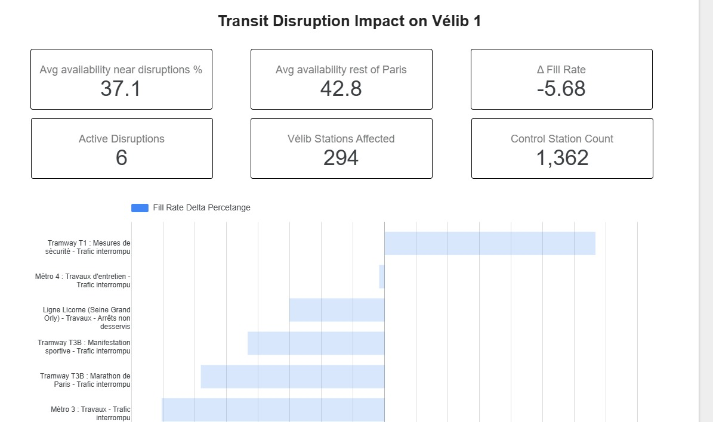
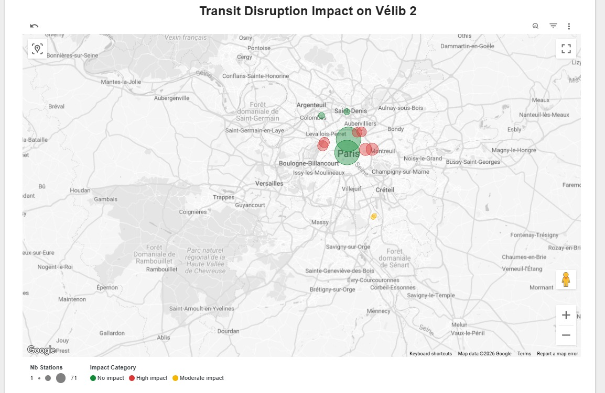

# 14 - Transit Disruption Impact Dashboard (Looker Studio)

The **Transit Disruption Impact** pages extend the Vélib Dashboard with a real-time spatial analysis of how transit disruptions affect nearby Vélib bike availability. These pages answer the core question of the project's cross-source analytics thesis:

> *When a Métro, RER, or Tramway line is disrupted, do nearby Vélib stations see a measurable drop in bike availability compared to the rest of Paris?*

[**View Live Dashboard**](https://lookerstudio.google.com/reporting/40ae9759-385b-4b7f-9248-325390e3c5df)

## Dashboard Pages

### Page 1 — KPIs & Per-Disruption Delta



**Scorecards (top row):**

| KPI | Description |
|---|---|
| **Avg availability near disruptions %** | Mean fill rate across all Vélib stations within 750m of any active heavy transit disruption |
| **Avg availability rest of Paris** | Mean fill rate for the spatial control group (stations far from any disruption) |
| **Δ Fill Rate** | Difference between the two averages. Negative = disruptions are draining bikes |
| **Active Disruptions** | Count of distinct heavy transit disruptions currently active (Métro, RER, Tramway) |
| **Vélib Stations Affected** | Total Vélib stations sitting inside any disruption's 750m impact zone |
| **Control Station Count** | Number of clean baseline stations powering the control average |

**Bar chart (bottom):** Shows the `fill_rate_delta_pct` for each individual disruption, allowing the viewer to instantly identify which specific line is causing the most severe local impact on Vélib availability.

### Page 2 — Geographic Impact Map



An interactive Google Maps overlay showing the geographic footprint of each disruption:

- **Bubble size** = Number of Vélib stations in the impact zone (`stations_in_impact_zone`)
- **Bubble color** = Impact severity category:
  - 🟢 **Green (No Impact)**: Δ ≥ 0% — local fill rate is equal to or above the Paris average
  - 🟡 **Yellow (Moderate Impact)**: -15% < Δ < 0% — a noticeable localized drain
  - 🔴 **Red (High Impact)**: Δ ≤ -15% — severe local bike shortage caused by stranded commuters

Each disruption is plotted at both its origin and destination transit stops, giving a visual sense of the disrupted corridor's geographic extent.

---

## Data Sources

Both pages are powered by dbt-managed BigQuery views:

| View | Purpose |
|---|---|
| `geomart_disruption_impact` | Spatial join: matches each active disruption to all Vélib stations within 750m |
| `mart_disruption_impact_comparison` | Computes fill rate for impact zone vs. spatial control group per disruption |
| `mart_disruption_impact_map` | Unpivots from/to stops into individual map-plottable rows with `location_point` |

### Data Lineage

```
idfm_disruptions (curated view)
  └─► geomart_disruption_impact (spatial join with velib_latest_state_enriched)
        ├─► mart_disruption_impact_comparison (A/B fill rate comparison)
        └─► mart_disruption_impact_map (map-ready with location_point)
```

### Key Filters Applied in the SQL

1. **Bus exclusion**: `NOT REGEXP_CONTAINS(title, r'^Bus ')` — Bus disruptions rarely generate enough stranded commuters to measurably impact Vélib. Only heavy transit (Métro, RER, Tramway, Train) is analyzed.
2. **Latest batch only**: `ingest_ts >= MAX(ingest_ts) - 30 MINUTE` — Ensures only currently active disruptions are shown.
3. **Île-de-France bounding box**: `from_lat BETWEEN 48.600 AND 49.100`, `from_lon BETWEEN 2.000 AND 2.700` — Focuses on disruptions within the greater Paris region.
4. **Bidirectional deduplication**: `LEAST(from_stop, to_stop)` / `GREATEST(from_stop, to_stop)` — Prevents IDFM's directional duplicates (A→B and B→A) from appearing as separate events.

---

## Interpreting the Results

### Time-of-Day Sensitivity

The macro Δ Fill Rate fluctuates throughout the day:

| Time Window | Expected Δ | Explanation |
|---|---|---|
| **7–9 AM** | Strong negative | Morning commuters drain bikes near broken lines |
| **12–2 PM** | Moderate negative | Lunch movement, partial recovery |
| **6–8 PM** | Weak or positive | Evening return flow masks the signal |
| **11 PM–2 AM** | Strong negative | No recovery flow, disruption damage is "frozen" |

### Per-Disruption vs. Macro Average

The **macro Δ** (city-wide average) may appear small because it averages dozens of disruptions together. The **per-disruption bar chart** is more revealing — individual Métro disruptions routinely show Δ values of **-30 to -50 percentage points**, confirming massive localized bike drainage.

> [!TIP]
> The strongest signal appears during **morning rush hour (7–9 AM)** when commuters who are dependent on disrupted heavy transit lines are forced to switch to Vélib as an alternative.

---

## Known Limitations

- **Spatial control only**: The current methodology compares "near disruption" vs. "far from disruption" at the same time. A temporal control (same station, same hour, different day) would be more robust but requires 4–6 weeks of continuous historical data.
- **Correlation ≠ causation**: Low bike availability near a disrupted stop could also reflect a nearby event, weather, or rush hour. The spatial control mitigates this but does not eliminate it.
- **750m radius is tunable**: Paris city blocks are ~100m, so 750m ≈ 7.5 blocks. This could be adjusted based on walking distance analysis.
- **Vélib coverage gaps**: Suburban disruptions may have zero Vélib stations in range. The analysis naturally excludes these (empty impact zones).

---

## Methodology Reference

For the full theoretical design and SQL sketch behind this analysis, see [13 - Cross-Source Disruption Impact Analysis](13-cross-source-disruption-impact-analysis.md).

For implementation details and known issues, see [13I - Disruption Impact Implementation Checkpoint](13I-disruption-impact-implementation-checkpoint.md).
