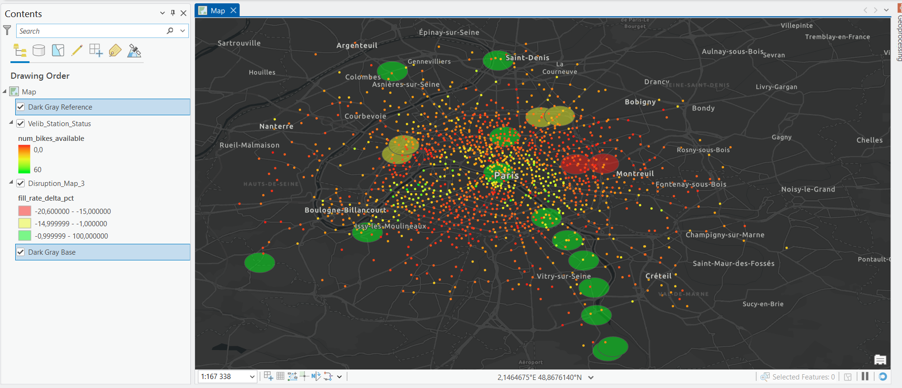

# 15I - ArcGIS Pro Integration Implementation Checkpoint

This document details the implementation path and challenges overcome to successfully render the Paris Mobility Pulse `pmp_marts` views dynamically inside Esri ArcGIS Pro. 

## Initial Attempt & Live SQL Evaluation

The initial objective was to avoid changing the existing dbt mart model, letting the GIS analyst write raw Custom SQL inside the ArcGIS Pro **Query Layer** dialog to generate the geometries on the fly. 

The original query tested was:

```sql
SELECT 
    CONCAT(disruption_id, '_', stop_role) AS unique_id,
    *,
    ST_GEOGPOINT(lon, lat) AS geom
FROM `paris-mobility-pulse.pmp_marts.mart_disruption_impact_map`
WHERE lon IS NOT NULL AND lat IS NOT NULL
```

### Challenge 1: Non-Integer Object IDs
This resulted in `The query is invalid. -2147024809: Value does not fall within the expected range` when attempting to finish the layer creation. ArcGIS Pro fundamentally struggles when the selected Unique Identifier field contains string/text data from an external ODBC source.

**Fix 1:** We swapped the primary key generation to `CAST(ROW_NUMBER() OVER() AS INT64) AS objectid`.

### Challenge 2: SQL Validation Hang (ROW_NUMBER)
The `ROW_NUMBER` fix solved the identifier data type, but caused ArcGIS Pro to hang indefinitely during the "Validating SQL..." phrase. `ROW_NUMBER()` forces BigQuery to pull all distributed data to a single execution node in order to number them sequentially down the list. This creates massive latency for the validation ping.

**Fix 2:** We swapped `ROW_NUMBER()` with a fast, deterministic hash function that runs in parallel: `ABS(FARM_FINGERPRINT(CONCAT(disruption_id, '_', stop_role))) AS objectid`. This successfully produced immediate map rendering.

---

## Expanding to Polygons & Driver Protocol Restrictions

After successfully mapping Point data, the objective expanded to replacing the dots with literal 750m physical radius circles reflecting the impact zone logic (utilizing BigQuery's `ST_BUFFER` function inside the Query Layer).

```sql
SELECT 
    ABS(FARM_FINGERPRINT(...)) AS objectid,
    *,
    ST_BUFFER(ST_GEOGPOINT(lon, lat), 750) AS geom
FROM ...
```

### Challenge 3: Simba ODBC Driver Temp Table Overreach
Running the `ST_BUFFER` dynamically returned a fatal connection error:

`Invalid SQL syntax [[Simba][BigQuery] (100) Error interacting with REST API: Access Denied: Dataset ... Permission bigquery.tables.create denied on dataset (or it may not exist).::42000]`

The Simba ODBC driver determines that generating hundreds of 750-meter spherical polygon vertices creates a "Large Result Set". To pipe this back to ArcGIS without crashing memory, the driver transparently wraps the query in an internal `CREATE TABLE _simba_temp_...` command, downloads from the temp table, then drops it.

Because the ArcGIS Pro connection utilizes a read-only service account (`roles/bigquery.dataViewer`), the creation request is hard-denied by GCP Identity and Access Management. 

## The Upstream Resolution 

Escalating the ArcGIS Pro read-only service account to `BigQuery Data Editor` was ruled out as a security anti-pattern. Analysts consuming data should not possess `CREATE / DROP` privileges.

**Final Solution:** 
We refactored `mart_disruption_impact_map.sql` directly inside the dbt project. 

The dbt project runs under `dbt-runner`, a service account strictly provisioned with full data editor rights to compile the warehouse. By adding the `objectid`, `geom_point`, and `geom_polygon_750m` logic into the view natively:

1. dbt pre-calculates the geometries during the hourly CI/CD run.
2. The read-only ArcGIS Pro account no longer initiates expensive geography logic.
3. The ArcGIS ODBC driver sees a simple projection request (`SELECT *`), circumventing the need for a temp staging table.
4. The integration performs perfectly seamlessly.

---

## ArcGIS Pro Query Layer Configuration Challenges

Even with pre-computed geometries, the ArcGIS Pro "New Query Layer" wizard presented several protocol and parsing challenges when connecting to BigQuery.

### Challenge 4: Multi-Geometry Silent Failures
The refactored `mart_disruption_impact_map` contained two geography columns: `geom_point` and `geom_polygon_750m`. Executing `SELECT *` in the Query Layer caused ArcGIS Pro to silently fail to render any features on the map, as it strict-limits layers to a single geometry field.
**Fix 4:** We utilized BigQuery's `EXCEPT` syntax to explicitly drop the conflicting point geometry during the ODBC fetch:
```sql
SELECT * EXCEPT (geom_point)
FROM `paris-mobility-pulse`.`pmp_dbt_dev_pmp_marts`.`mart_disruption_impact_map`
```

### Challenge 5: SRID Auto-Discovery Failure
BigQuery `GEOGRAPHY` types do not consistently expose their underlying Spatial Reference ID (SRID) through the Simba ODBC driver in a way ArcGIS can auto-discover, leaving the Finish button grayed out.
**Fix 5:** We altered the configuration from "Let ArcGIS Pro discover spatial properties" to "Define spatial properties for the layer", manually selecting the `objectid` primary key and explicitly assigning `GCS WGS 1984` (SRID `4326`) as the coordinate system.

### Challenge 6: Bounding Box Calculation
Because the `GEOGRAPHY` data lacks a pre-calculated index typically found in Enterprise Geodatabases, ArcGIS Pro could not automatically determine the layer extent, presenting completely blank boundary boxes.
**Fix 6:** We retained the "Input Extent" setting or manually inputted the physical bounding box bounds for the Île-de-France region (Top: 49.2, Bottom: 48.5, Left: 2.0, Right: 2.7) to ensure "Zoom to Layer" functionality performed correctly without defaulting to a global extent.

## Beta Visual Composition

To build the beta analytical dashboard:
1. **Disruption Zones:** The polygon layer was styled using **Graduated Colors** on the `fill_rate_delta_pct` metric (Red/Yellow/Green to represent severity) with a **50% Layer Transparency**.
2. **Vélib Stations Overlay:** We injected the live station status using a secondary Query Layer on `velib_latest_state_enriched`, converting the floating coordinates on the fly (`ST_GEOGPOINT(lon, lat)`). 
3. **Heatmap Formatting:** The stations were scaled down to 2-3pt markers and styled with Graduated Colors based on bike availability. 
4. **Basemap:** The underlying Esri Topographic map was swapped to a **Dark Gray Canvas**, causing the brightly colored impact zones and empty (Red) stations clustering within them to stand out sharply, visually proving the cross-entity data pipeline's thesis.


